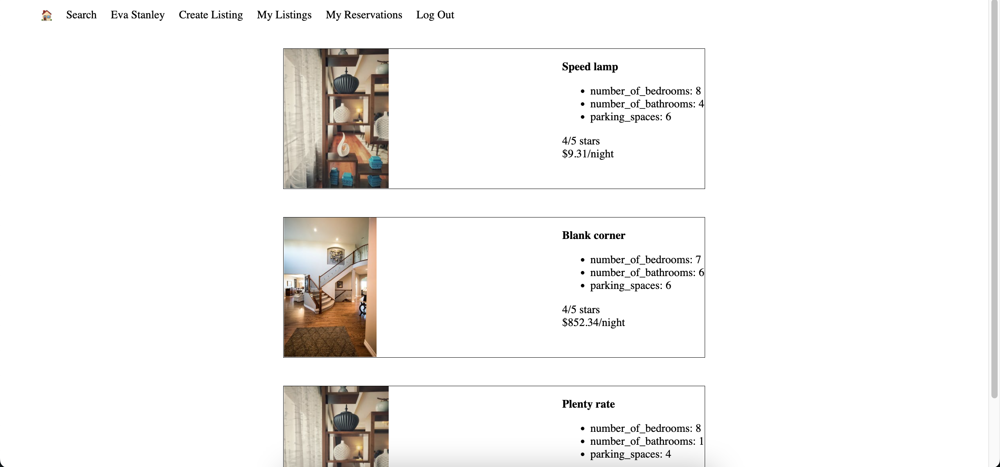
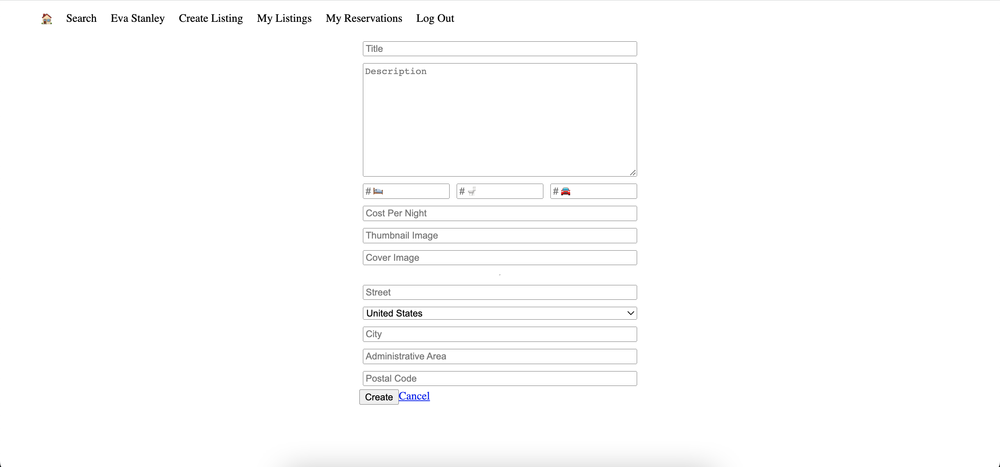
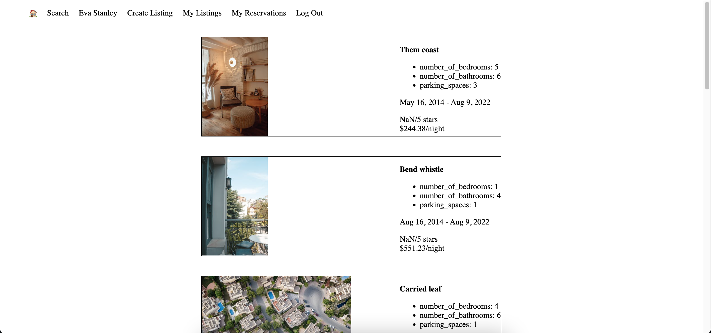

# Light BnB App

Light BnB is a simple, SPA that allows logged in users to browse, create, edit and delete listings for short term rentals and view past reservations.

## Final Product

Current Listings when logged in as Eva Stanley:

Create New Listing when logged in as Eva Stanley:

Past Reservations when logged in as Eva Stanley:

## Getting Started

1. Navigate to LightBnB_WebApp directory and install dependencies using the `npm install` command.
2. Start the web server using the `npm start` command. The app will be served at <http://localhost:3000/>.
3. Go to <http://localhost:3000/> in your browser.
4. Sign up with new account or Log in with username: "sebastianguerra@ymail.com" and password: "password"

## Project Stack

- Front-End: HTML, SASS, JavaScript

- Back-End: Express, Node.js

- Database: PostgresSQL

## Dependencies

- bcrypt
- body parser
- cookie session
- express
- nodemon
- pg
